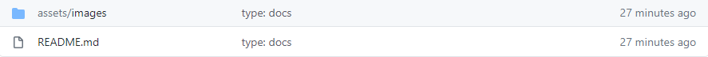
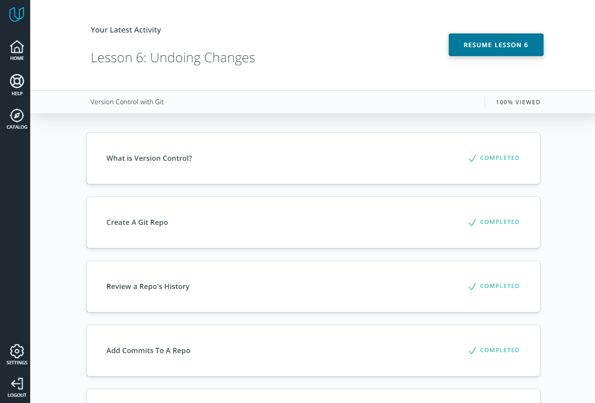
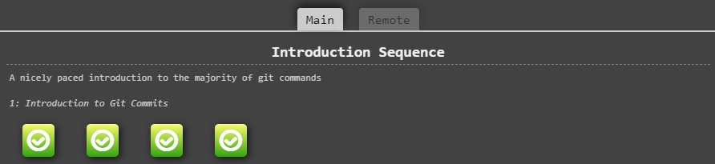
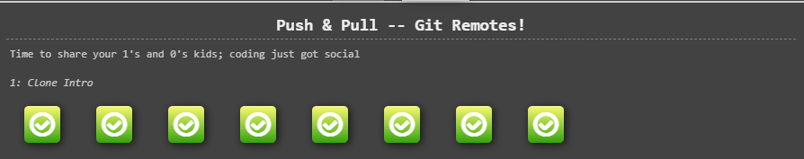
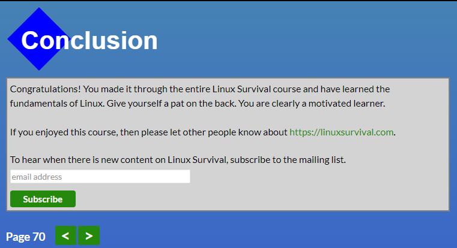

# Nazar kottans progress

### General
0. [x] [Git Basics](#git-and-github)
1. [x] [Linux CLI and Networking](#linux-cli-and-http)
2. [ ] VCS (hello gitty), GitHub and Collaboration
### Front-End Basics
3. [ ] Intro to HTML & CSS
4. [ ] Responsive Web Design
5. [ ] HTML & CSS Practice
6. [ ] JavaScript Basics
7. [ ] Document Object Model - practice
### Advanced Topics
8. [ ] Building a Tiny JS World (pre-OOP) - practice
9. [ ] Object oriented JS - practice
10. [ ] OOP exercise - practice
11. [ ] Offline Web Applications
12. [ ] Memory pair game — real project!
13. [ ] Website Performance Optimization
14. [ ] Friends App - real project!
***

## Git and GitHub 

   1. I was using Git for some time but in this course I found a few features I didn't know earlier like: 
    * **git tag** - with this you can mark some important things or version number in your commit history
    * **git rebase** - rebase commit from one branch on top of another
    
   2. I was really surprised after I have read [Udacity Git Commit Message Style Guide](https://udacity.github.io/git-styleguide/) 
    because this guide can help structure your commit message and made it more understandable. As well, I forgot possibility of 
    committing separate files, so my commits were large and with lots of words *"and"*.
    
   */ *Just tried to use Udacity [Udacity Git Commit Message Style Guide](https://udacity.github.io/git-styleguide/) and it turned out 
    to be uncomfortable. Because when you follow rules of this guide you press **Enter** after type of commit, so when you are looking in
    your code editor or GitHub you see only type of commit without a message.*
    
   
    
   3. Also, I have read about global `.gitignore` file, because I'm using WebStorm IDE, and I don't want to commit `.idea` file so 
     this and Udacity Git Commit Message Style Guide I will use in next projects.
    
   #### Screenshots
    
   - Finished course [Version Control with Git](https://www.udacity.com/course/version-control-with-git--ud123)
    
   
    
   - Completed levels at [learngitbranching.js.org](https://learngitbranching.js.org/)
    
   
    
   
    
   ***
    
## Linux CLI, and HTTP

   #### Linux CLI    
        
   >Before [Linux Survival (4 modules)](https://linuxsurvival.com/linux-tutorial-introduction/) I thought that 
    Linux is really difficult to understand, but passing this course I understood that it is just *another way of working*.
    So if you want to work with command line (what can be faster than finding suitable function in Windows interface for example)
    Linux is os for you, but be ready to study this system for few months.                        
        
   1. For me, in Linux CLI new was commands like:
    
   - pwd - print working dir
   - lpr - send a file to printer
   - finger - user info lookup program
   
   and *[many others](https://www.linuxtrainingacademy.com/linux-commands-cheat-sheet)*...
    
   2. I was surprised in similarity of some Linux commands and windows 
    commands like **cd**, **cp**, **rmdir** and other. Also, I was impressed 
    such a huge possibility of managing users with *groups*, *finger*, *chmod* 
    commands.
    
   3. I want to try Linux, but more modern like Ubuntu and try to make 
    small local storage for my family with different admissions for users.
    
   #### HTTP
    
   >[HTTP: The Protocol Every Web Developer Must Know - Part 1](https://code.tutsplus.com/tutorials/http-the-protocol-every-web-developer-must-know-part-1--net-31177) and
    [HTTP: The Protocol Every Web Developer Must Know - Part 2](https://code.tutsplus.com/tutorials/http-the-protocol-every-web-developer-must-know-part-2--net-31155)
    are good articles, but topic about *headers* was difficult to read. So I also saw 
    a few videos: [Http-protocol](https://ru.coursera.org/lecture/python-for-web/http-protokol-wUUuG) and  
    [Parts of an HTTP Request](https://www.youtube.com/watch?v=pHFWGN-upGM&ab_channel=Udacity) where some info is graphically showing well.
     
   1. I didn't know about informational messages, Ruby on Rails and jQuary Ajax 
    appointment, cache, document expiration and server revalidation.
    
   2. I was wondered difference between **HTTP/1.0 and HTTP/1.1**. For example: 
    info messages is ignoring in HTTP/1.0, only in HTTP/1.1 were introduced persistent 
    connections.
    
   3. In the future, I intend to **cache** to improve my sites productivity and 
    **authentication** to use site on different devices without losing data and I
    think **kottans** will help me to deal with it.
    
   #### Screenshots
    
   - [Linux Survival (4 modules)](https://linuxsurvival.com/linux-tutorial-introduction/) completed
    
   
    
   ***
    

