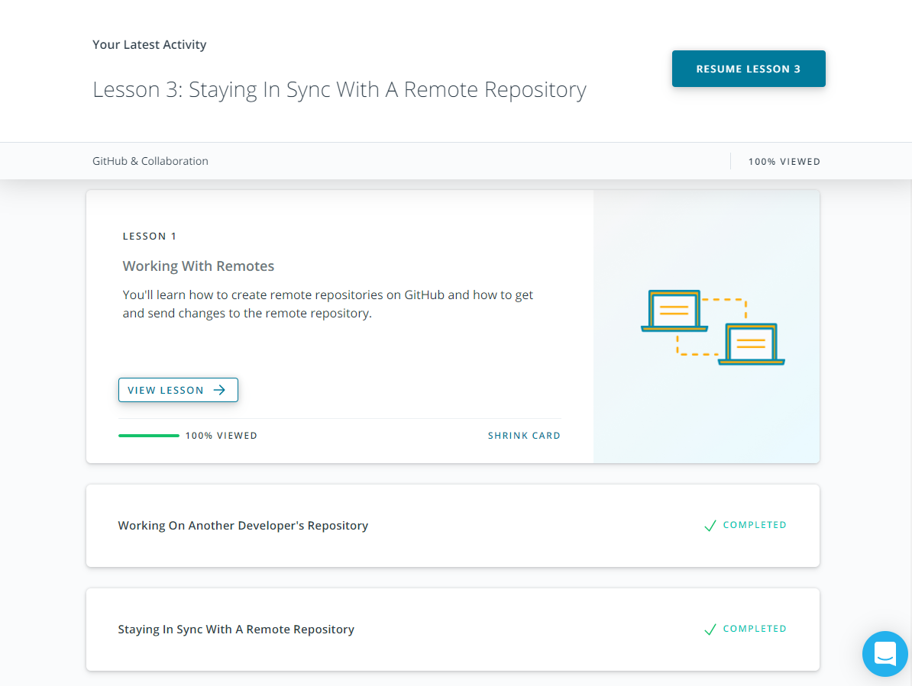
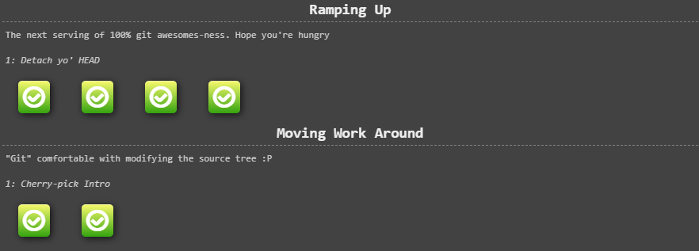
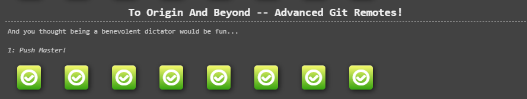
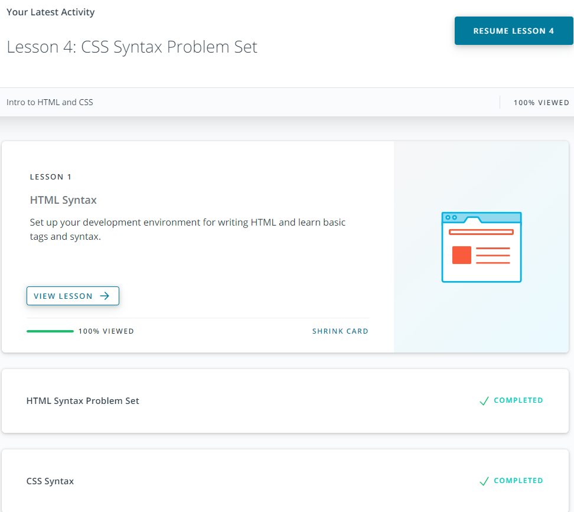
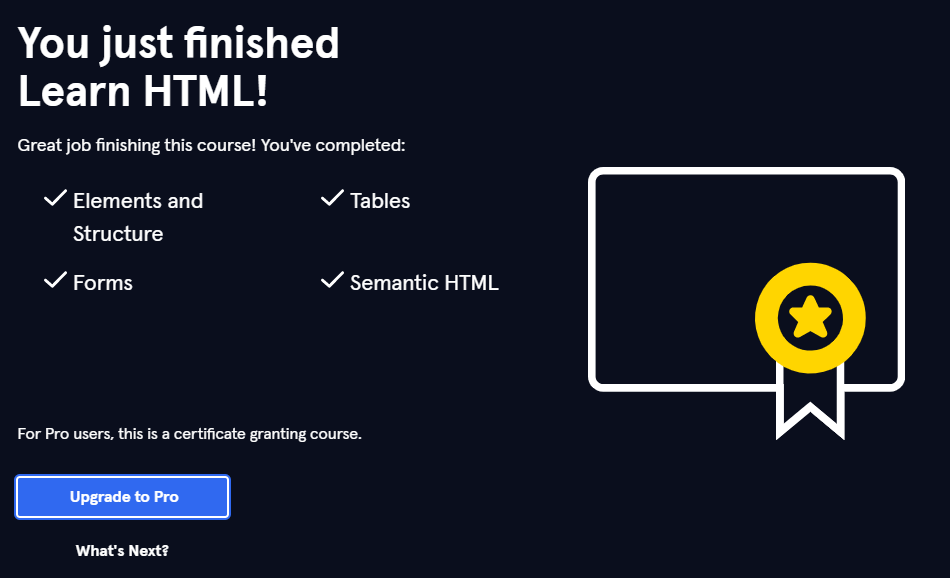
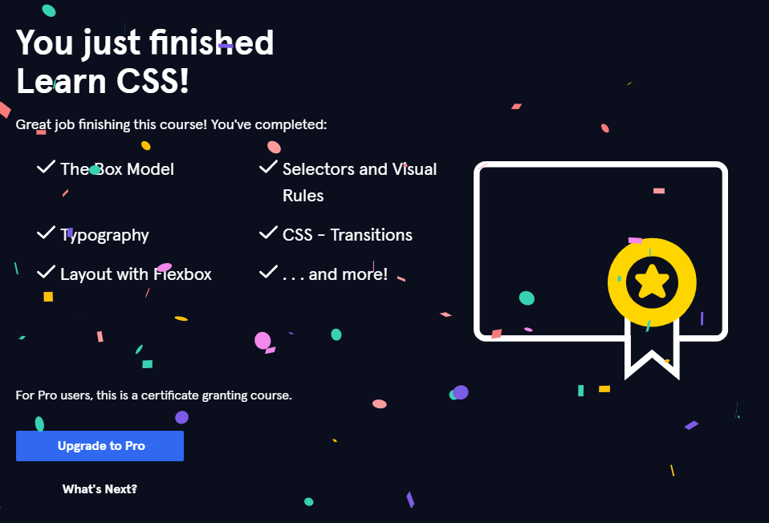

# Nazar kottans progress

### General
0. [x] [Git Basics](#git-and-github)
1. [x] [Linux CLI and Networking](#linux-cli-and-http)
2. [x] [VCS (hello gitty), GitHub and Collaboration](#git-for-team-collaboration)
### Front-End Basics
3. [x] [Intro to HTML & CSS](#intro-to-html-and-css)
4. [ ] Responsive Web Design
5. [ ] HTML & CSS Practice
6. [ ] JavaScript Basics
7. [ ] Document Object Model - practice
### Advanced Topics
8. [ ] Building a Tiny JS World (pre-OOP) - practice
9. [ ] Object oriented JS - practice
10. [ ] OOP exercise - practice
11. [ ] Offline Web Applications
12. [ ] Memory pair game — real project!
13. [ ] Website Performance Optimization
14. [ ] Friends App - real project!
***

## Git and GitHub 

  1. I was using Git for some time but in this course I found a few features I didn't know earlier like: 
  
     * `git tag` - with this you can mark some important things or version number in your commit history
     * `git rebase` - rebase commit from one branch on top of another
    
  2. I was really surprised after I have read [Udacity Git Commit Message Style Guide](https://udacity.github.io/git-styleguide/) 
    because this guide can help structure your commit message and made it more understandable. As well, I forgot possibility of 
    committing separate files, so my commits were large and with lots of words *"and"*.
    
        * *Just tried to use Udacity [Udacity Git Commit Message Style Guide](https://udacity.github.io/git-styleguide/) and it turned out 
        to be uncomfortable. Because when you follow rules of this guide you press **Enter** after type of commit, so when you are looking in
        your code editor or GitHub you see only type of commit without a message.*
    
        
    
  3. Also, I have read about global `.gitignore` file, because I'm using WebStorm IDE, and I don't want to commit `.idea` file so 
     this and Udacity Git Commit Message Style Guide I will use in next projects.
     
  #### Screenshots
     
  <details>
    <summary>
        Finished course <a href="https://www.udacity.com/course/version-control-with-git--ud123">Version Control with Git</a>
    </summary>
          
  </details>
             
  <details>
    <summary>
        Completed levels at <a href="https://learngitbranching.js.org/">learngitbranching.js.org</a>
    </summary>
    
          
  </details>
   
***
    
## Linux CLI, and HTTP

   #### Linux CLI    
        
   Before [Linux Survival (4 modules)](https://linuxsurvival.com/linux-tutorial-introduction/) I thought that 
   Linux is really difficult to understand, but passing this course I understood that it is just *another way of working*.
   
   So if you want to work with command line (what can be faster than finding suitable function in Windows interface for example)
   Linux is os for you, but be ready to study this system for few months.                        
        
   1. For me, in Linux CLI new was commands like:
    
      - `pwd` - print working dir
      - `lpr` - send a file to printer
      - `finger` - user info lookup program
   
      and *[many others](https://www.linuxtrainingacademy.com/linux-commands-cheat-sheet)*...
    
   2. I was surprised in similarity of some Linux commands and windows 
    commands like `cd`, `cp`, `rmdir` and other. Also, I was impressed 
    such a huge possibility of managing users with `groups`, `finger`, `chmod` 
    commands.
    
   3. I want to try Linux, but more modern like Ubuntu and try to make 
    small local storage for my family with different admissions for users.
    
   #### HTTP
    
   [HTTP: The Protocol Every Web Developer Must Know - Part 1](https://code.tutsplus.com/tutorials/http-the-protocol-every-web-developer-must-know-part-1--net-31177) and
   [HTTP: The Protocol Every Web Developer Must Know - Part 2](https://code.tutsplus.com/tutorials/http-the-protocol-every-web-developer-must-know-part-2--net-31155)
   are good articles, but topic about *headers* was difficult to understand. 
    
   So I also saw a few videos: [Http-protocol](https://ru.coursera.org/lecture/python-for-web/http-protokol-wUUuG) and  
   [Parts of an HTTP Request](https://www.youtube.com/watch?v=pHFWGN-upGM&ab_channel=Udacity) where some info is graphically showing well.
     
   1. I didn't know about informational messages, Ruby on Rails and jQuary Ajax 
    appointment, cache, document expiration and server revalidation.
    
   2. I was wondered difference between **HTTP/1.0 and HTTP/1.1**. For example: 
    info messages is ignoring in HTTP/1.0, only in HTTP/1.1 were introduced persistent 
    connections.
    
   3. In the future, I intend to **cache** to improve my sites productivity and 
    **authentication** to use site on different devices without losing data and I
    think **kottans** will help me to deal with it.
    
   #### Screenshots
        
   <details>
        <summary>
            <a href="https://linuxsurvival.com/linux-tutorial-introduction/">Linux Survival (4 modules)</a> completed
        </summary>
           
   </details>
   
***
    
## Git for Team Collaboration
    
   I was starting this module with thought *"I know this, that will be fast"*...
   
   That wasn't very fast but was really exiting and to broaden my horizons I also 
   saw [Git guide](https://www.youtube.com/watch?v=en6gms6e54Q&list=PLIU76b8Cjem5B3sufBJ_KFTpKkMEvaTQR&ab_channel=Devcolibri)
   on youtube and that was really enjoyable, so: 
   
   1. For me new were commands:
      
      - `git stash` - recording current state of working directory with possibility of going back to clean working directory.
      - `git rebase` - reapply commits on top of another base tip.
      - `git cherry-pick` - you can take one or two commits from a branch individually rather than merging in the branch which takes all the changes.
      
      Also, I noticed some useful word-combinations such as:
      
      - **pros/cons** - плюси та мінуси.
      - **long story short** - короче кажучи.
      
   2. I was impressed of git stash command existence, and it's power. Also, I realized
    difference between `git pull --rebase` and `git pull --merge`, but I use merge, 
    because, as for me, this is more comfortable. In addition, I appreciated command 
    
   3. I'm definitely will use all this commands in the future, but for more practice 
    working in team is need, hope *kottans* will help me with improving my git skills)
    
   #### Screenshots
   
   <details>
        <summary>
            <a href="https://classroom.udacity.com/courses/ud456">GitHub & Collaboration</a> completed
        </summary>
           
   </details>
      
   <details>
        <summary>
            <a href="https://linuxsurvival.com/linux-tutorial-introduction/">Linux Survival (4 modules)</a> completed
        </summary>
           
           
   </details>
   
***

## Intro to HTML and CSS
    
   So, my target was to improve my knowledge about semantic HTML and CSS grid and I did this.
   
   1. To tell long story short, new for me were tags like: 
   
      <details>
         <summary>
            Semantic tags:
         </summary>
         <ul>
            <li><code>section</code> - independent, self-contained content (blog post).</li>
            <li><code>article</code> - defines a section in a document.</li>
            <li><code>header</code> - represents a container for introductory content or a set of navigational links.</li>
            <li><code>footer</code> - defines a footer for a document or section.</li>
            <li><code>nav</code> - defines a set of navigation links.</li>
            <li><code>aside</code> - defines some content aside from the content it is placed in (like a sidebar).</li>
            <li><code>figcaption</code> - defines a caption for a <code>figure</code> element.</li>
            <li><code>figure</code> - specifies self-contained content, like illustrations, diagrams, photos, code listings, etc.</li>            
            <li><code>main</code> - specifies the main content of a document.</li>
            <li><code>mark</code> - defines text that should be marked or highlighted.</li>
            <li><code>section</code> - defines a section in a document.</li>
            <li><code>time</code> - defines a specific time.</li>
         </ul>
      </details>
      
      <details>
         <summary>
            New tags:
         </summary>
         <ul>
            <li><code>picture</code> - gives web developers more flexibility in specifying image resources.</li>
            <li><code>video</code> - is used to embed video content in a document, such as a movie clip or other video streams.</li>
            <li><code>audio</code> - is used to embed sound content in a document, such as music or other audio streams.</li>
            <li><code>source</code> - is used to specify multiple media resources for media elements.</li>
            <li><code>datalist</code> - specifies a list of pre-defined options for an <code>input</code> element.</li>
            <li><code>select</code> -  is used to create a drop-down list.</li>
            <li><code>optgroup</code> - is used to group related options in a <code>select</code> element (drop-down list).</li>
            <li><code>option</code> -  defines an option in a select list.</li>
            <li><code>option</code> -  defines an option in a select list.</li>
           <li><code>option</code> -  defines an option in a select list.</li>
           <li><code>option</code> -  defines an option in a select list.</li>
         </ul>
      </details>
   
      <details>
         <summary>
            New css properties:
         </summary>
         <ul>
            <li><code>word-spacing</code> - increases or decreases the white space between words.</li>
            <li><code>letter-spacing</code> - increases or decreases the white space between letters..</li>
            <li><code>line-height</code> - specifies the height of a line.</li>
            <li><code>text-transform</code> - controls the capitalization of text.</li>
            <li><code>float</code> - specifies how an element should float.</li>
            <li><code>clear</code> - specifies what elements can float beside the cleared element and on which side.</li>
            <li><code>grid-template</code> - is a shorthand property for defining grid columns, rows, and areas.</li>
            <li><code>grid-area</code> -  specifies a grid item's size and location in a grid layout.</li>
         </ul>
      </details>
        
   2. div is abbreviation for **division** - I was really impressed when I saw this. Because I was 
   using and don't even know about this. Also, I saw a misplaced clock(see below) on CodeAcademy. 
   
        
   
        It's css was:
   
         ```
         position: absolute;
         top: -.25rem;
         left: -.25rem;
         ```  
        Top and left must be ***-.35rem***;
   
   3. In this few courses I learned about grid and semantic HTML. In addition, section about 
   Typography was very interesting. Besides, of this `*{  }` is very an important selector 
   for resetting browser styles. Some css values like `repeat`, `minmax`, `span` will be useful in 
   the future ,and I will use this at the first opportunity.
   
   #### Screenshots
   
   <details>
        <summary>
            <a href="https://www.udacity.com/course/intro-to-html-and-css--ud001">Intro to HTML & CSS (Eng)</a> completed
        </summary>
           
   </details>
      
   <details>
        <summary>
            <a href="https://www.codecademy.com/learn/learn-html">Learn HTML(Eng)</a> completed
        </summary>
              
   </details>
   
   <details>
        <summary>
            <a href="https://www.codecademy.com/learn/learn-html">Learn CSS(Eng)</a> completed
        </summary>
              
   </details>
   
***   