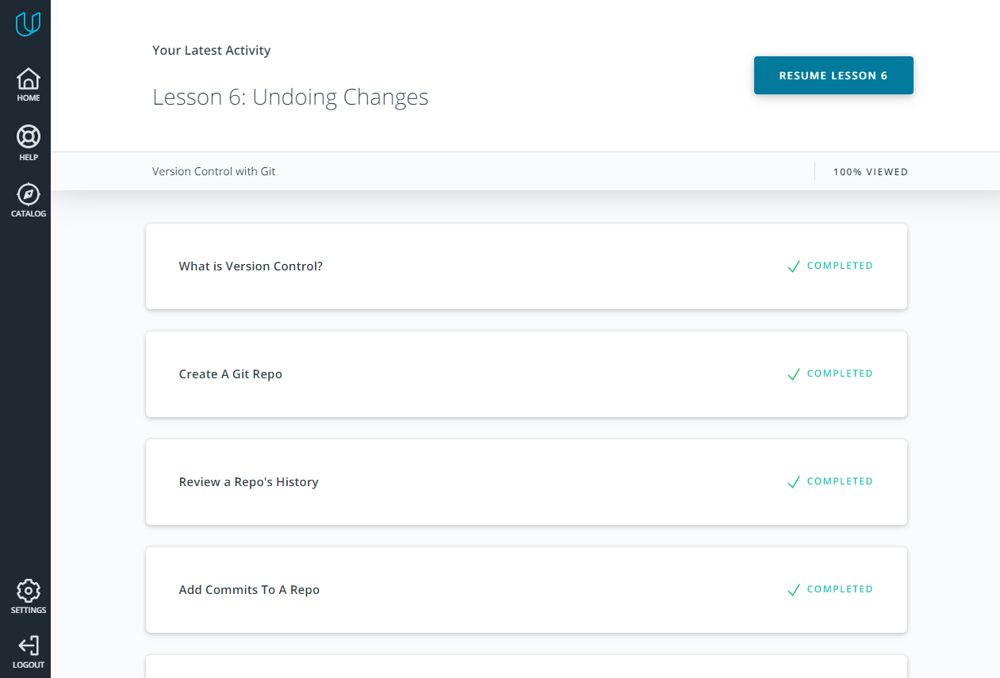
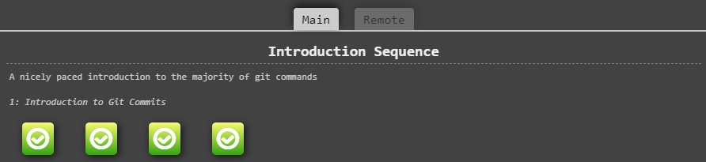
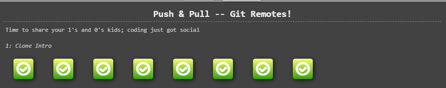

#Nazar kottans progress

1. ###Git and GitHub 

    1.1 I was using Git for some time but in this course I found a few features I didn't know earlier like: 
    * **git tag** - with this you can mark some important things or version number in your commit history
    * **git rebase** - rebase commit from one branch on top of another
    
    1.2 I was really surprised after I have read [Udacity Git Commit Message Style Guide](https://udacity.github.io/git-styleguide/) 
    because this guide can help structure your commit message and made it more understandable. As well, I forgot possibility of 
    committing separate files, so my commits were large and with lots of words *"and"*
    
    1.3 Also I have read about global `.gitignore` file, because I'm using WebStorm IDE, and I don't want to commit `.idea` file so 
    this and Udacity Git Commit Message Style Guide I will use in next projects.
    
    ####Screenshots
    
    - Finished course [Version Control with Git](https://www.udacity.com/course/version-control-with-git--ud123)
    
    
    
    - Completed levels at [learngitbranching.js.org](https://learngitbranching.js.org/)
    
    
    
    
    
    

    